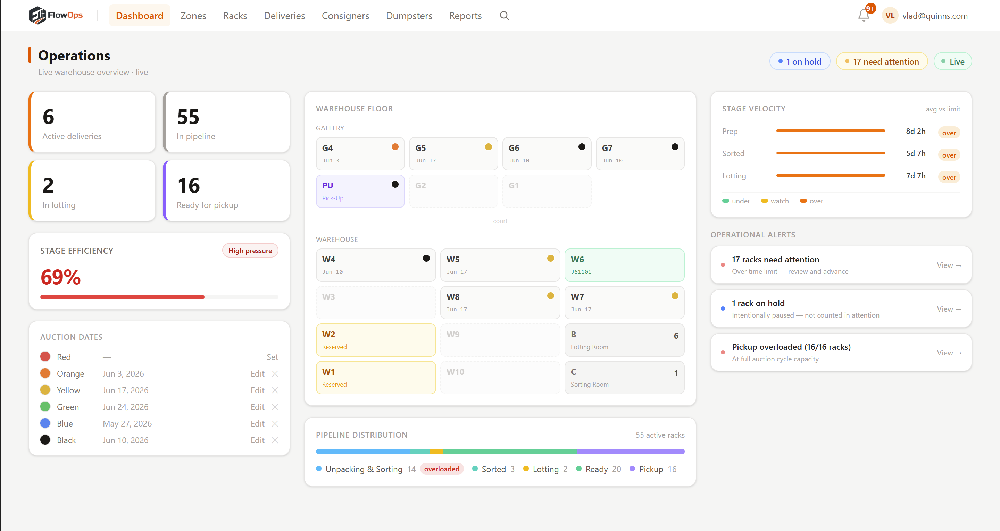
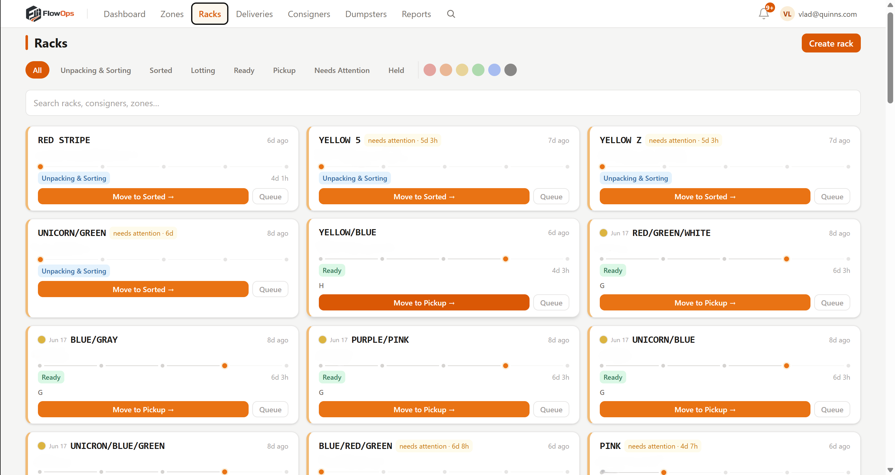
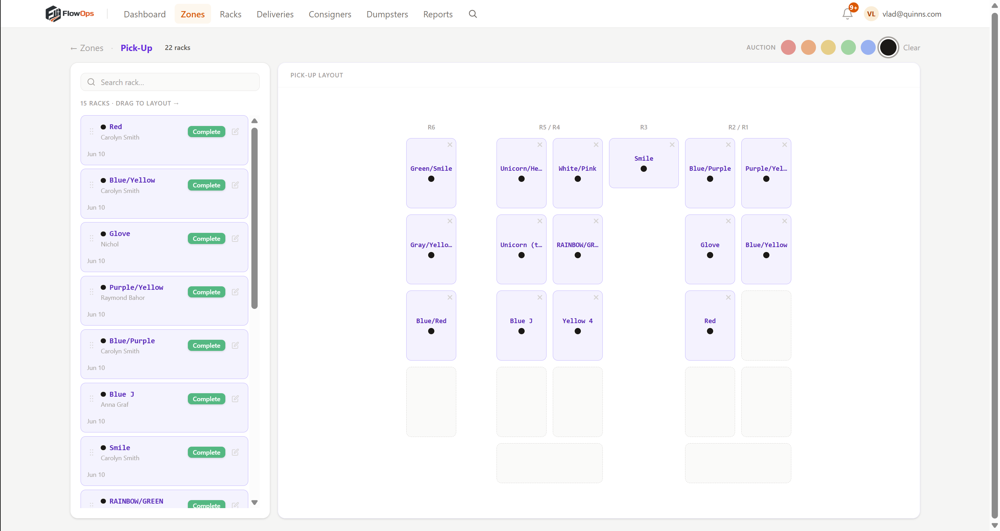
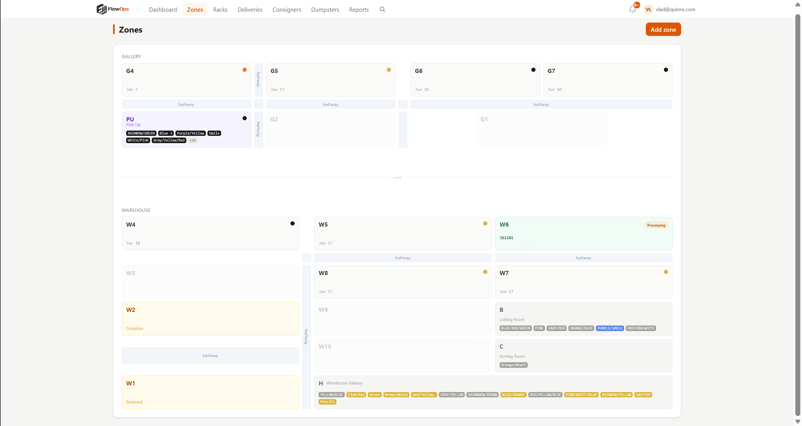
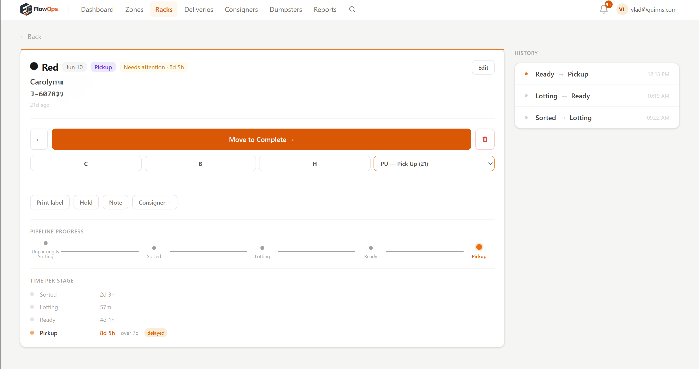
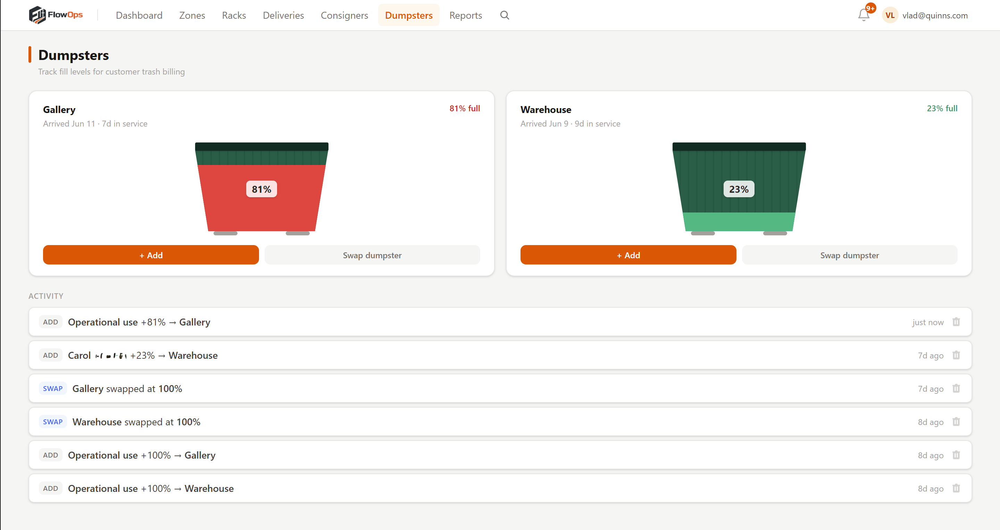
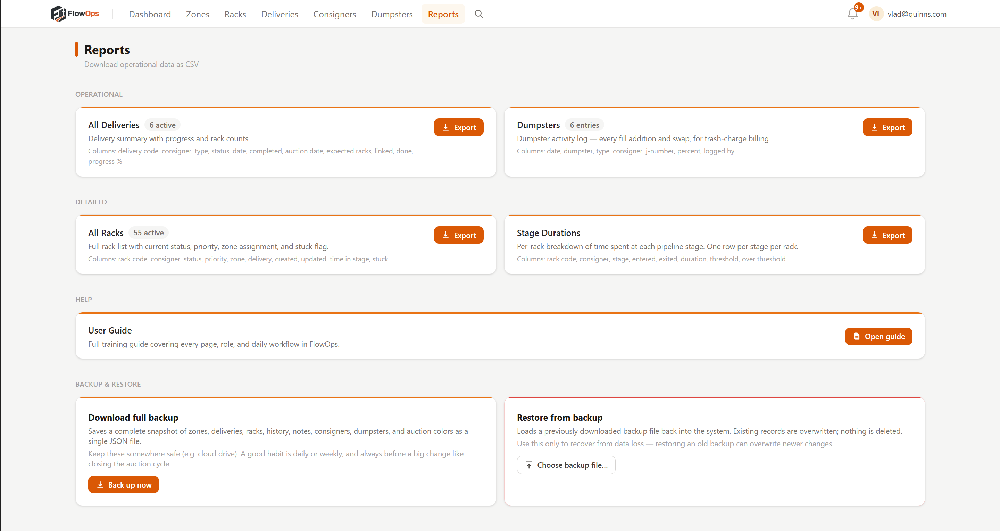

# FlowOps

**A working warehouse coordination system, built end-to-end for a real consignment operation to replace verbal relay and whiteboards with a shared, role-specific system.**

Built for Quinn's Auction Galleries, a consignment and donation-resale warehouse operation. Six weeks, 94 commits. The system is complete and deployment-ready, but Quinn's did not move forward with adoption — it has not run in live production. This project is presented here as a technical build and case study, not as a deployed product with measured results.

---

## The problem it's built to solve

Throughput in a consignment warehouse is capped by how fast information travels between people, not by how fast people work. Before FlowOps: a manager walked the floor to tell each role what to do next, staff walked the floor to find consigner goods or check rack status, and nothing surfaced a stalled rack until it was visibly in the way. Auction deadlines were tracked by memory. Trash billing had no audit trail.

FlowOps is designed to replace that coordination with a live, role-specific shared system — each job on the floor gets its own filtered queue showing exactly what needs doing next, with problems flagged automatically instead of waiting for someone to notice.

---

## Screenshots

*Operations dashboard: live KPIs, warehouse floor map, pipeline distribution, stage velocity vs. thresholds, and operational alerts.*

*Racks list: pipeline stage, time in stage, and automatic "needs attention" flags per stage threshold.*

*Pick-up floor plan: drag-and-drop rack positioning by bay slot — physical layout, not just status.*

*Warehouse floor map: every bay shows its current purpose and occupancy, color-coded by auction run.*

*Rack detail: full pipeline progress, per-stage time vs. threshold, and complete stage history.*

*Dumpster tracking: timestamped, per-consigner fill entries — the audit trail for trash billing.*

*Reports: four CSV exports and full-database backup/restore, on demand.*

---

## The pipeline

Every item is tracked on a physical **rack** through a fixed six-stage sequence:

**Unpacking & Sorting → Sorted → Lotting → Ready → Pickup → Completed**

Each stage has a business-hours-aware time threshold. The system flags any rack that exceeds its stage threshold automatically — no one has to check. When the last rack in a delivery clears, the delivery closes itself. When a rack advances to pickup, it's auto-placed in the pickup zone.

---

## Role-scoped views

Six jobs, six dedicated experiences — each role sees only the stages and actions relevant to their work:

| Role | What they see |
|---|---|
| **Admin** | Full dashboard, all stages, all reports, user management |
| **Front Desk** | Intake only — walk-in and scheduled delivery creation |
| **Unpacker / Sorter** | Unpacking & Sorting queue, rack creation, QR scanner |
| **Lotter** | Sorted queue → Lotting → Ready, priority-sorted |
| **Pickup** | PU drag-and-drop floor plan |

---

## Stack

**Next.js 15 · React 19 · TypeScript · Supabase (Postgres + Realtime + Auth + Storage) · Zustand · Framer Motion · Tailwind v4 · html5-qrcode**

No separate backend service. Business logic lives in the Next.js client and Postgres functions. Realtime sync via Supabase subscriptions. Role permissions enforced at both the edge middleware and UI layers from a single source of truth (`lib/roles.ts`).

---

## Documentation

- **[Case Study](docs/case-study.md)** — problem framing, discovery process, design decisions, and roadmap
- **[Impact Report](docs/impact-report.md)** — one-page business summary with projected/estimated impact, not a measured result
- **[Development Log](docs/development-log.md)** — 13 build sessions reconstructed from git history, including the honest outcome (see Session 14)

---

*Vladyslav Vashchuk · June 2026 · [vladvashchuk2005@gmail.com](mailto:vladvashchuk2005@gmail.com)*
